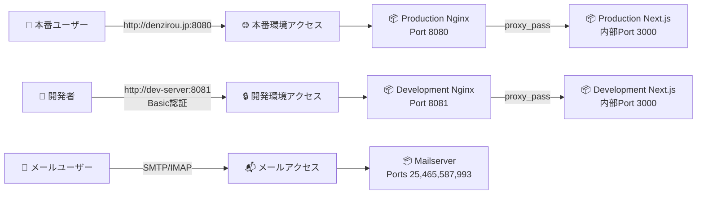
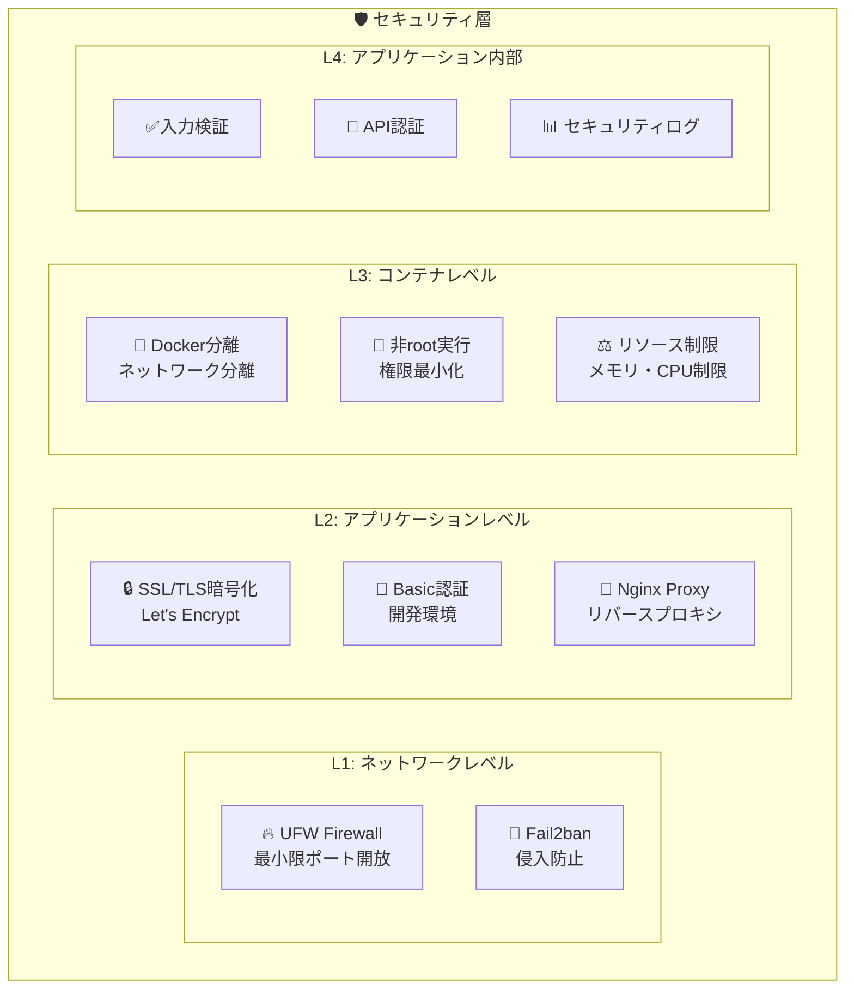
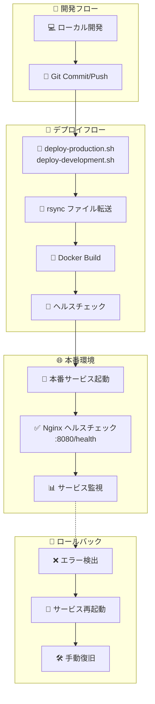
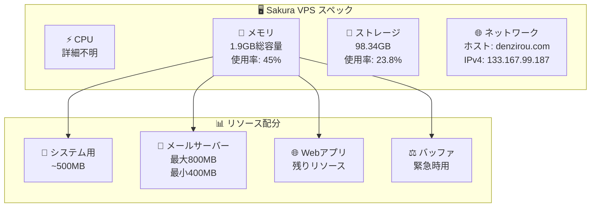
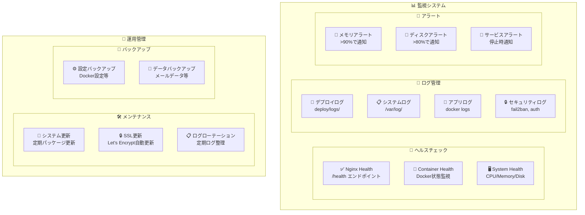

# インフラ構成図

## 全体システム構成

```mermaid
graph TB
    %% Internet
    Internet[🌐 Internet]
    
    %% DNS
    CloudFlare[☁️ CloudFlare DNS<br/>denzirou.jp<br/>mail.denzirou.com]
    
    %% Sakura VPS
    subgraph SakuraVPS["🖥️ Sakura VPS (Ubuntu 22.04)"]
        subgraph UFW["🔥 UFW Firewall"]
            Port22[Port 22: SSH]
            Port25[Port 25: SMTP]
            Port80[Port 80: HTTP]
            Port443[Port 443: HTTPS]
            Port465[Port 465: SMTPS]
            Port587[Port 587: SMTP-AUTH]
            Port993[Port 993: IMAPS]
            Port8080[Port 8080: 本番Web]
            Port8081[Port 8081: 開発Web]
        end
        
        subgraph SystemServices["🔧 システムサービス"]
            SSH[SSH Service]
            Nginx[Nginx (System)]
            Certbot[Let's Encrypt<br/>Certbot]
            Fail2Ban[Fail2ban]
            Docker[Docker Engine]
        end
        
        subgraph DockerEnv["🐳 Docker環境"]
            subgraph ProdNetwork["本番環境ネットワーク<br/>(denzirou-production-network)"]
                ProdNginx[📦 nginx:latest<br/>Port: 8080→80]
                ProdWeb[📦 Next.js App<br/>内部Port: 3000<br/>外部非公開]
            end
            
            subgraph DevNetwork["開発環境ネットワーク<br/>(denzirou-development-network)"]
                DevNginx[📦 nginx:latest<br/>Port: 8081→80<br/>Basic認証]
                DevWeb[📦 Next.js App<br/>内部Port: 3000<br/>外部非公開]
            end
            
            subgraph MailNetwork["メールサーバーネットワーク<br/>(mailserver-network)"]
                MailServer[📦 docker-mailserver<br/>Ports: 25,465,587,993<br/>Security: ClamAV無効<br/>Memory: 800M制限]
            end
        end
        
        subgraph Storage["💾 ストレージ"]
            MailData[📁 /opt/denzirou-multi-env/<br/>├── production/<br/>├── development/<br/>└── mailserver/data/]
            SSLCerts[🔒 /etc/letsencrypt/<br/>SSL証明書]
            Logs[📄 /var/log/<br/>システムログ]
        end
    end
    
    %% External Services
    LetsEncrypt[🔒 Let's Encrypt<br/>SSL証明書発行]
    
    %% Connections
    Internet --> CloudFlare
    CloudFlare --> SakuraVPS
    LetsEncrypt --> Certbot
    
    %% Internal connections
    Port8080 --> ProdNginx
    Port8081 --> DevNginx
    ProdNginx --> ProdWeb
    DevNginx --> DevWeb
    Port25 --> MailServer
    Port465 --> MailServer
    Port587 --> MailServer
    Port993 --> MailServer
    
    %% Storage connections
    MailServer --> MailData
    Certbot --> SSLCerts
    Docker --> Logs
```

## ネットワーク構成詳細

### 外部アクセス構成



### セキュリティ層構成



## デプロイメントフロー



## リソース構成

### サーバースペック



### ディスク構成

```bash
# ディスク使用量構成
/                           98.34GB (23.8%使用)
├── /opt/denzirou-multi-env/
│   ├── production/         # 本番環境ファイル
│   ├── development/        # 開発環境ファイル
│   └── logs/              # デプロイログ
├── /etc/letsencrypt/       # SSL証明書
├── /var/lib/docker/        # Dockerデータ
├── /var/log/              # システムログ
└── /home/admin/           # 管理者ホーム
```

## 監視・運用構成



## セキュリティ設定詳細

### ファイアウォール設定
```bash
# UFW ファイアウォール設定
sudo ufw default deny incoming    # デフォルト拒否
sudo ufw default allow outgoing   # デフォルト許可
sudo ufw allow ssh               # SSH (22)
sudo ufw allow 80/tcp            # HTTP
sudo ufw allow 443/tcp           # HTTPS  
sudo ufw allow 25/tcp            # SMTP
sudo ufw allow 465/tcp           # SMTPS
sudo ufw allow 587/tcp           # SMTP-AUTH
sudo ufw allow 993/tcp           # IMAPS
sudo ufw allow 8080/tcp          # 本番Web
sudo ufw allow 8081/tcp          # 開発Web
```

### Docker セキュリティ
```yaml
# セキュリティ強化設定
services:
  web:
    # 外部ポート非公開（nginx経由のみ）
    # ports: なし
    
  nginx:
    # 最小限のポート公開
    ports:
      - "8080:80"  # 本番
      - "8081:80"  # 開発
      
  mailserver:
    # メモリ制限でDoS対策
    deploy:
      resources:
        limits:
          memory: 800M
```

この構成により、セキュアで運用しやすいインフラストラクチャが実現されています。